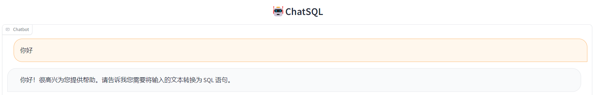
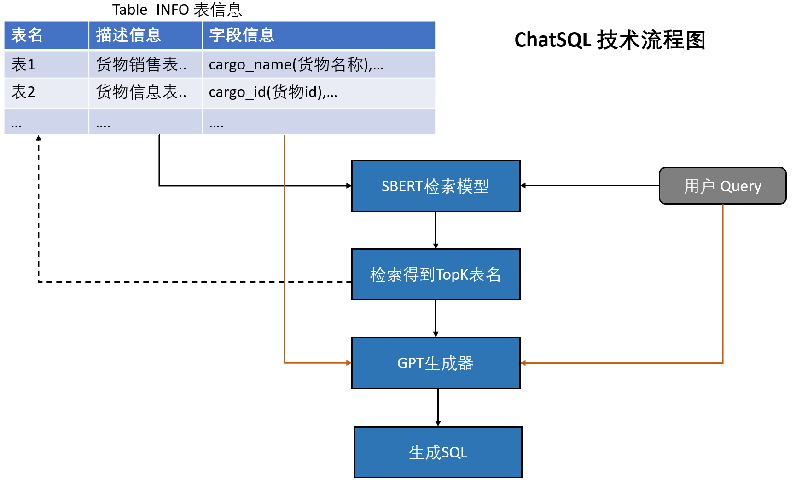
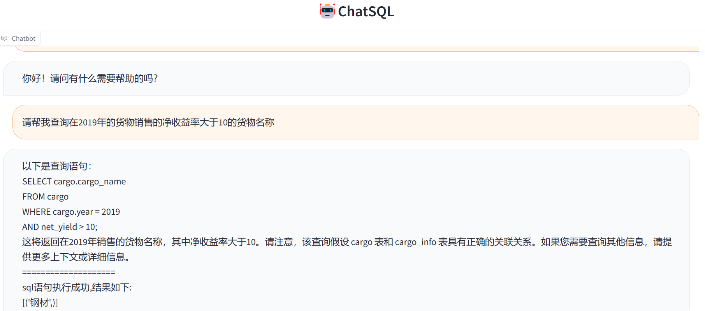

# ChatSQL
基于ChatGLM-6B/MOSS(后续增加),实现nl2sql，直连数据库并返回查询结果
目前仅支持MYSQL语法,后续支持多数据库语法查询
* 目前观察下来，ChatGLM-6B多轮交互上限在3-4轮，之后就无法正确生成准确的SQL语句


## 🚀 HuggingFace初体验
[HuggingFace/ChatSQL](https://huggingface.co/spaces/ls291/ChatSQL)❤️感谢HuggingFace提供免费CPU资源

> 目前配置为:v2CPU-16GRAM 进行部署，基于ChatGLM-int4模型，推理时间感人，如果本地有资源的同学还是下载在本地进行尝试😘


## ✨ 整体思路

整体思路如上，目前采用yaml文件代替Table_info表结构

## 🎬 开始
```
git clone git@github.com:yysirs/ChatSQL.git
cd ChatSQL
conda create -n chatsql python=3.9
conda activate chatsql
pip install -r requirements.txt
# 生成本地数据库+插入数据
python local_database.py
# 基于GLM生成SQL
python main_gui.py
或者 基于MOSS生成SQL
python main_gui_moss.py
```

## 😁 效果演示


## 👍 特性
- 🛒 支持多表联查
- 🖼️ 2023/04/24 支持web前端
- 🎉 2023/04/24 支持yaml自定义数据库schema
- 😁 2023/04/25 支持yaml自定义数据
- 🎗️ 2023/04/25 支持直连本地数据库查询,验证SQL是否正确

## 🔍 各种类型的查询
```
# 单表多条件查询
请帮我查询在2019年的货物销售的净收益率大于10的货物名称

# 两表联查
请帮我查询在2019年的净收益率大于10并且销售量大于100的销售负责人名字

# 两表多条件联查
请帮我查询在2019年的货物的净收益率大于10并且销售量大于100并且销售负责人业绩大于1000的销售负责人名字

# max
请帮我查询货物销售量最大的货物名称

# min
请帮我查询货物销售量最小的货物名称

# COUNT
请帮我查询在2019年的货物销售的净收益率大于10的货物名称的数目

# AVG
请帮我查询2019年以及2020年货物销售量的平均值

# GROUP BY
请根据年份进行分组查询货物销售量和年份

# ORDER BY
请帮我按照数量大小对货物名称进行排序

# SUM	
请帮我查询货物的销售量总和是多少

```
##  🔨 TODO LIST
* [x] 增加web前端
* [x] yaml可配置数据库schema
* [x] 采用sqlite本地数据库操作,验证SQL语句是否正确
* [ ] In-Context Prompt作为yaml文件外挂
* [ ] 优化各类查询语句，如：ORDER BY、GROUP BY / HAVING 等复杂查询
* [ ] 优化相似度查询模块
* [ ] 其他SQL语法查询，如：ORACLE(关系型数据库)、Cypher(图数据库)
* [ ] Docker部署
* [ ] SQL领域微调ChatGLM/MOSS

## ❤️ 致谢
- [ChatGLM-6B](https://github.com/THUDM/ChatGLM-6B):ChatGLM-6B模型提供大语言模型能力
- [MOSS](https://github.com/OpenLMLab/MOSS):MOSS模型提供大语言模型能力
